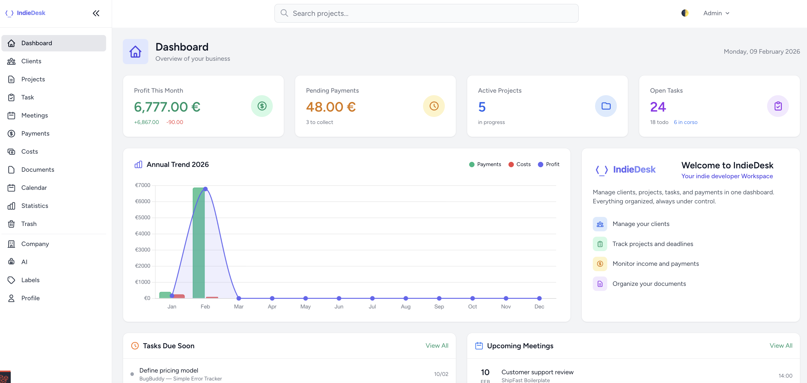

# IndieDesk

A self-hosted Laravel workspace for indie developers  
to track projects, revenue and costs, without spreadsheets.

▶ [Watch the demo on YouTube](https://www.youtube.com/watch?v=Z-LmKAyYH0k&t=1s)

---

## What is IndieDesk?

IndieDesk is a Laravel template designed around how indie developers
actually manage projects.

Instead of juggling spreadsheets, notes and tools, IndieDesk keeps
tasks, documents, costs, payments and stats tied to each project
with full control over your code and data.

You self-host it. You own it. You adapt it to your workflow.

---

## Who is this for?

IndieDesk is built for:

- Indie developers and solo founders
- Freelancers managing multiple projects or revenue streams
- Developers who want to own and customize their internal tools

It's probably **not** for you if:

- You're looking for accounting or tax software
- You want a hosted SaaS with subscriptions
- You don't plan to work with Laravel at all

---

## What's included

- Projects, tasks (with labels & status) and meetings
- Documents per project
- Costs & payments tracking
- Invoice drafts generated per project
- Project statistics (monthly / yearly)
- GitHub integration (heatmap & commits)
- AI assistant with project context
- Tax tracker
- Business settings (fiscal regime, ATECO codes, pension)
- Clean, documented Laravel structure

---

## Screenshots

### Project overview

### Dashboard

### Stats

---

## Tech stack

- Laravel
- Blade
- Tailwind CSS
- Alpine.js
- SQLite / MySQL

---

## Getting started

### Requirements

- PHP 8.4
- Composer
- Node.js
- SQLite / MySQL

Full documentation:  
<a href="https://docs.indiedesk.link" target="_blank">docs.indiedesk.link</a>

Website:  
<a href="https://indiedesk.link" target="_blank">indiedesk.link</a>

---

Multi-language ready.  
IndieDesk ships with built-in translations. No setup required.

🇬🇧 🇮🇹 🇪🇸 🇫🇷 🇩🇪 🇵🇹 🇳🇱 🇩🇰 🇷🇴 🇵🇱 🇷🇺 🇺🇦 🇨🇳  
13 languages included.

---

## License

IndieDesk is released under the **GNU General Public License v3 (GPL-3.0)**.

You are free to use, modify and distribute this software.  
Any modified version you distribute must also be released under GPL v3.  
You cannot close the source and sell it as a proprietary product.

Full license: [https://www.gnu.org/licenses/gpl-3.0.txt](https://www.gnu.org/licenses/gpl-3.0.txt)

---

Built by an indie developer, for indie developers.
